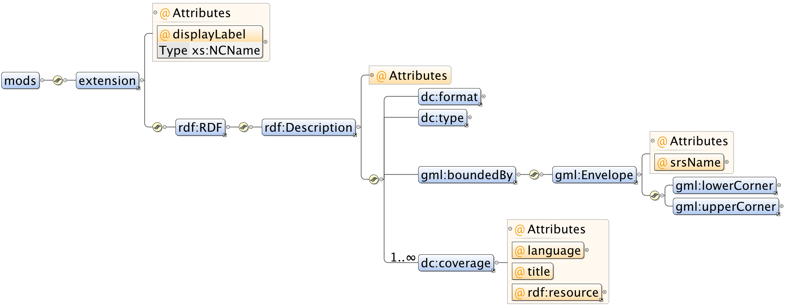
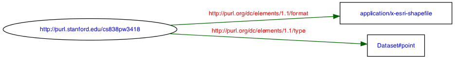
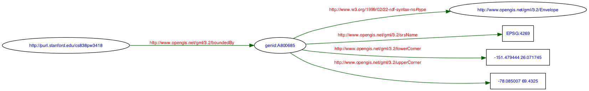
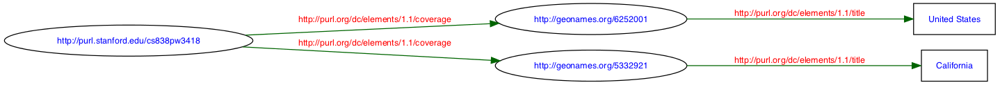

#### Introduction

This schema focuses on discovery use cases for patrons and analysts in a research library
setting, although it is likely useful in other settings. Text search, faceted search and
refinement, and spatial search and relevancy are among the primary features that the schema
enables. The schema design supports a variety of discovery applications and GIS data types.
We especially wanted to provide for contextual collection-oriented discovery applications as
well as traditional portal applications.

#### Example

The `examples` folder has some Solr documents that uses this schema. First, install the
schema into a Solr 4 instance, then upload the documents.

    # install conf/ into your SOLR_HOME folder
    % cd examples
	  % ruby upload-to-solr.rb your-collection-name http://localhost:8080
		
#  Schema for GeoBlacklight

Note that the suffixes in the schema attribute names are used by the Solr schema implementation.

### Primary key

**uuid**
: 	Unique Identifier. Examples:
:    `http://purl.stanford.edu/vr593vj7147`,
:    `http://ark.cdlib.org/ark:/28722/bk0012h535q`,
:    `urn:geodata.tufts.edu:Tufts.CambridgeGrid100_04`

### Dublin Core

See the [Dublin Core Elements Guide](http://dublincore.org/documents/dcmi-terms/) for semantic descriptions of all of these fields.
We're using both DC Elements and DC Terms.

**dct_spatial_sm**
:	Coverage, placenames. Multiple values allowed. Example: `Paris, France`.

**dct_temporal_sm**
:	Coverage, years. Multiple values allowed. Example: `2010`

**dc_creator_sm**
:	Author(s). Example: `Washington, George`.

**dct_issued_s**
:	Date issued. Example: `2010` or `2008-02-18`

**dc_description_s**
: 	Description.

**dc_format_s**
:	File format (not MIME types). Valid values:
    `Shapefile`,
    `GeoTIFF`
	
**dc_identifier_s**
:	Unique identifier. Same as UUID.

**dc_language_s**
: 	Language. Example: `English`.

**dc_publisher_s**
: 	Publisher. Example: `ML InfoMap (Firm)`.

**dct_references_sm**
: 	URLs to referenced resources using XLink. 
	Role values are based on [CatInterop](https://github.com/OSGeo/Cat-Interop) Multiple values allowed. 
	Example: `<xlink link="simple" role="http://www.opengis.net/def/serviceType/ogc/wfs" href="http://geowebservices-restricted.stanford.edu/geoserver/wfs"/>`

**dc_rights_s**
: 	Rights for access. Valid values:
    `Restricted`
    `Public`
	
**dct_provenance_s**: Source institution: Examples:
:    Berkeley
:    Harvard
:    MassGIS
:    MIT
:    Stanford
:    Tufts

**dc_subject_sm**
: 	Subject. Multiple values allowed. Example: `Human settlements, Census`

**dc_title_s**
: 	Title.

**dc_type_s** 
: 	Resource type. dc:type=Dataset for georectified images, dc:type=Image for
:	digitaized, non-georectified images, or dc:type=PhysicalObject for paper maps (no
:	digitization).

**dct_isPartOf_sm**
: 	Collection to which the layer belongs.

**dct_available_sm**
: 	Date range for when the data are available.

### GeoRSS

We use [GeoRSS](http://georss.org) for geometry encoding. Note that all data are in WGS84
(EPSG:4326 projection). Depending on your usage, only the bounding box field is required.

**georss_point_s**
: 	Point representation for layer -- i.e., centroid?

**georss_box_s**
: 	Bounding box as maximum values for S W N E. Example: `12.62309 76.76 19.91705 84.76618`

**georss_polygon_s**
: 	Shape of the layer as a Polygon.
:	Example: "n w n e s e s w n w"

### Layer-specific metadata

A variety of attributes are required for the discovery application. These are all layer-specific.

**layer_slug_s**
:	Unique identifier visible to the user, used for Permalinks.
:	Example: `stanford-vr593vj7147`.

**layer_id_s**
: 	The complete identifier for the WMS/WFS/WCS layer.
:	Example: `druid:vr593vj7147`

**layer_geom_type_s**
:	Valid values are: `Point`, `Line`, `Polygon`, and `Raster`.

### Derived metadata used by Solr index

For the Solr 4 implementation, we derive a few Solr-specific fields from other schema
properties.

**solr_pt**
: 	(from `georss_point_s` using `solr.LatLonType`). Point in y,x. Example: `12.62309,84.76618`

**solr_bbox**
: 	(from `georss_box_s` using `solr.SpatialRecursivePrefixTreeFieldType`). Bounding box as maximum values for W S E N. Example: `76.76 12.62309 84.76618 19.91705`

**solr_geom**
: 	(from `georss_polygon_s` using **JTS** version of `solr.SpatialRecursivePrefixTreeFieldType`). Shape of the layer as a Point, LineString, or Polygon WKT.
:	Example: `POLYGON((76.76 19.91705, 84.76618 19.91705, 84.76618 12.62309, 76.76 12.62309, 76.76 19.91705))`

**solr_ne_pt**
: 	(from `solr_bbox` using `solr.LatLonType`). North-eastern most point of the bounding box, as (y, x). Example: `83.1,-128.5`

**solr_sw_pt**
: 	(from `solr_bbox` using `solr.LatLonType`). South-western most point of the bounding box, as (y, x). Example: `81.2,-130.1`

**solr_issued_dt**
:   (from `dct_issued_s` using `solr.TrieDateField`). in Solr syntax. Example: `2001-01-01T00:00:00Z`.

**solr_year_i**
: 	(from `dct_temporal_sm` using `solr.TrieIntField`): Year for which layer is valid. Example: `2012`.

## Solr4 schema implementation

The [schema.xml](https://github.com/sul-dlss/geoblacklight-schema/blob/master/conf/schema.xml) is on Github. The
schema makes heavy use of the `dynamicField` feature of Solr. Here are the suffixes to yield the datatype.

| Suffix | Solr data type using *dynamicField* | Solr *fieldType* Class |
| ------ | --------------------------------- | --------------------- |
| `_s` | String | `solr.StrField` |
| `_sm` | String, multivalued | `solr.StrField` |
| `_t` | Text, English | `solr.TextField` |
| `_i` | Integer | `solr.TrieIntField` |
| `_dt` | Date time | `solr.TrieDateField` |
| `_url` | URL as a non-indexed String | `solr.StrField` |
| `_bbox` | Spatial bounding box, Rectangle as (w, s, e, n) | `solr.SpatialRecursivePrefixTreeFieldType` |
| `_pt` | Spatial point as (y,x) | `solr.LatLonType` |
| `_geom` | Spatial shape as WKT | *JTS* version of `solr.SpatialRecursivePrefixTreeFieldType` |

Here is an example of the schema implementation for the spatial types:

```xml
<?xml version="1.0" encoding="UTF-8"?>
<schema name="GeoBlacklight" version="1.5">
  <uniqueKey>uuid</uniqueKey>
  <fields>
    ...
    <dynamicField name="*_d"    type="double"  stored="true"  indexed="true"/>
    ...
    <dynamicField name="*_pt"     type="location"     stored="true" indexed="true"/>
    <dynamicField name="*_bbox"   type="location_rpt" stored="true" indexed="true"/>
    <dynamicField name="*_geom"   type="location_jts" stored="true" indexed="true"/>
  </fields>
  <types>
	...
    <fieldType name="double" class="solr.TrieDoubleField"  precisionStep="8" positionIncrementGap="0"/>
    ...
    <fieldType name="location" class="solr.LatLonType" subFieldSuffix="_d"/>
    <fieldType name="location_rpt" class="solr.SpatialRecursivePrefixTreeFieldType"
               distErrPct="0.025"
               maxDistErr="0.000009"
               units="degrees"
            />
    <fieldType name="location_jts" class="solr.SpatialRecursivePrefixTreeFieldType"
               spatialContextFactory="com.spatial4j.core.context.jts.JtsSpatialContextFactory"
               distErrPct="0.025"
               maxDistErr="0.000009"
               units="degrees"
            />
  </types>
</schema>
```

# Solr queries

We provide a set of example Solr queries against this schema.

### Solr 3: Pseudo-spatial using `solr.LatLon`

`solr.LatLonType` does not correctly work across the international dateline in these queries. `_pt` in these examples are assumed
to be `solr.LatLonType`.

#### Search for point within 50 km of N40 W114

Note: Solr `_bbox` uses circle with radius (not rectangles).

```xml
<str name="d">50</str>
<str name="q">*:*</str>
<str name="sfield">solr_pt</str>
<str name="pt">40,-114</str>
<str name="fq">{!geofilt}</str>
```

#### Search for single point _within_ a bounding box of SW=40,-120 NE=50,-110

```xml
<str name="q">*:*</str>
<str name="fq">solr_pt:[40,-120 TO 50,-110]</str>
```

#### Search for bounding box _within_ a bounding box of SW=20,-160 NE=70,-70

```xml
<str name="q">*:*</str>
<str name="fq">solr_sw_pt:[20,-160 TO 70,-70] AND solr_ne_pt:[20,-160 TO 70,-70]</str>
```

### Solr 4 Spatial

#### Search for point _within_ a bounding box of SW=20,-160 NE=70,-70

```xml
<str name="q">*:*</str>
<str name="fq">solr_pt:"Intersects(-160 20 -70 70)"</str>
```

#### Search for bounding box _within_ a bounding box of SW=20,-160 NE=70,-70

```xml
<str name="q">*:*</str>
<str name="fq">solr_sw_pt:[20,-160 TO 70,-70] AND solr_ne_pt:[20,-160 TO 70,-70]</str>
```


#### ... using polygon intersection

```xml
<str name="q">*:*</str>
<str name="fq">solr_bbox:"Intersects(-160 20 -70 70)"</str>
```

#### ... using polygon containment

```xml
<str name="q">*:*</str>
<str name="fq">solr_bbox:"IsWithin(-160 20 -150 30)"</str>
```

#### ... using polygon containment for spatial relevancy

This is the **primary** query used by GeoBlacklight. In this example, we score containment by
10x and issue a text query, then filter the results via intersection.

```xml
<str name="q">solr_bbox:"IsWithin(-160 20 -150 30)"^10 railroads</str>
<str name="fq">solr_bbox:"Intersects(-160 20 -150 30)"</str>
```

### Solr 4 Spatial *using  JTS*

This query requires [JTS](http://tsusiatsoftware.net/jts/main.html) installed in
Solr 4, where the
`spatialContextFactory="com.spatial4j.core.context.jts.JtsSpatialContextFactory"`
for the `solr.SpatialRecursivePrefixTreeFieldType` field class.

#### Search for bbox _intersecting_ bounding box of SW=20,-160 NE=70,-70 using polygon intersection

```xml
<str name="q">*:*</str>
<str name="fq">solr_bbox:"Intersects(POLYGON((-160 20, -160 70, -70 70, -70 20, -160 20)))"</str>
```

### Scoring formula

This is the default scoring formula in
[solrconfig.xml](https://github.com/sul-dlss/geoblacklight-schema/blob/master/conf/solrconfig.xml):

	text^1
	dc_description_ti^2
	dc_creator_tmi^3
	dc_publisher_ti^3
	dct_isPartOf_tmi^4
	dc_subject_tmi^5
	dct_spatial_tmi^5
	dct_temporal_tmi^5
	dc_title_ti^6
	dc_rights_ti^7
	dct_provenance_ti^8
	layer_geom_type_ti^9
	layer_slug_ti^10
	dc_identifier_ti^10

### Facets

These attributes are all available as facets:

	dct_isPartOf_sm
	dct_provenance_s
	dct_spatial_sm
	dc_format_s
	dc_language_s
	dc_publisher_s
	dc_rights_s
	dc_subject_sm
	layer_geom_type_s
	solr_year_i

# Solr example documents


These metadata would be generated from the OGP Schema, or MODS, or FGDC, or ISO 19139. For example, from 
[OGP to GeoBlacklight](https://github.com/sul-dlss/geohydra/blob/master/ogp/transform.rb).

```xml
<doc>
    <str name="uuid">http://purl.stanford.edu/qb767ss4042</str>
	
    <str name="dc_description_s">This polygon dataset shows pre-delimitation state Legislative Assembly constituency boundaries and
    data relating to the 2007 Assembly elections for the State of Uttar Pradesh, India. Map includes data for 403 constituencies.
    Includes attribute data on election parties, candidates, voters, and results. This layer is part of the Poll Map of India which
    includes parliamentary constituency boundaries for India, Assembly constituency boundaries for all states, and data relating to
    the past national elections for each State of India.; This data can be used for election analysis, forecasting, and mapping:
    Enables profiling of individual constituencies, permits historical analysis of the data, and helps predictive estimate of the
    impact of regional and state-wise electorate swings on the performance of political parties. These data are intended for
    researchers, students, and policy makers for reference and mapping purposes, and may be used for basic applications such as
    viewing, querying, and map output production.; </str>
    <str name="dc_format_s">Shapefile</str>
    <str name="dc_identifier_s">http://purl.stanford.edu/qb767ss4042</str>
    <str name="dc_language_s">English</str>
    <str name="dc_publisher_s">ML InfoMap (Firm)</str>
    <str name="dc_rights_s">Restricted</str>
    <arr name="dc_subject_sm">
      <str>Boundaries</str>
      <str>Elections</str>
      <str>Political Parties</str>
      <str>Politics and government</str>
      <str>Society</str>
      <str>Voting</str>
    </arr>
    <str name="dc_title_s">Uttar Pradesh, India: Pre Delimitation State Assembly Constituency Boundaries and Election Data, 2007</str>
    <str name="dc_type_s">Dataset</str>
	
    <arr name="dct_isPartOf_sm">
      <str>PollMap of India</str>
    </arr>
    <arr name="dct_references_sm">
      <str><xlink type="simple" role="urn:iso:dataFormat:ISO19139" href="http://purl.stanford.edu/qb767ss4042.iso19139"/></str>
      <str><xlink type="simple" role="urn:loc:dataFormat:MODS" href="http://purl.stanford.edu/qb767ss4042.mods"/></str>
      <str><xlink type="simple" role="urn:ogc:serviceType:WebFeatureService" href="http://geowebservices-restricted.stanford.edu/geoserver/wfs"/></str>
      <str><xlink type="simple" role="urn:ogc:serviceType:WebMapService" href="http://geowebservices-restricted.stanford.edu/geoserver/wms"/></str>
      <str><xlink type="simple" role="urn:x-osgeo:link:www" href="http://purl.stanford.edu/qb767ss4042"/></str>
      <str><xlink type="simple" role="urn:x-osgeo:link:www-thumbnail" href="https://stacks.stanford.edu/file/druid:qb767ss4042/preview.jpg"/></str>
    </arr>
    <arr name="dct_spatial_sm">
      <str>Agra</str>
      <str>Ghāziābād</str>
      <str>Khatauli</str>
      <str>Kushinagar</str>
      <str>Lucknow</str>
      <str>Meerut</str>
      <str>Muzaffarnagar</str>
      <str>Rāmpur</str>
      <str>Sahāranpur</str>
      <str>Uttar Pradesh</str>
      <str>Vārānasi</str>
    </arr>
    <arr name="dct_temporal_sm">
      <str>2007</str>
    </arr>
    <date name="dct_issued_dt">2000-01-01T00:00:00Z</date>
    <str name="dct_provenance_s">Stanford</str>
    
	<str name="georss_box_s"><georss:box>23.9 77.1 30.4 84.6</georss:box></str>
    <str name="georss_polygon_s"><georss:polygon>30.4 77.1 30.4 84.6 23.9 84.6 23.9 77.1 30.4 77.1</georss:polygon></str>
	
    <str name="layer_slug_s">stanford-qb767ss4042</str>
    <str name="layer_id_s">druid:qb767ss4042</str>
    <str name="layer_srs_s">EPSG:4326</str>
    <str name="layer_geom_type_s">Polygon</str>
	
    <str name="solr_bbox">77.1 23.9 84.6 30.4</str>
    <str name="solr_ne_pt">30.4,84.6</str>
    <double name="solr_ne_pt_0_d">30.4</double>
    <double name="solr_ne_pt_1_d">84.6</double>
    <str name="solr_sw_pt">23.9,77.1</str>
    <double name="solr_sw_pt_0_d">23.9</double>
    <double name="solr_sw_pt_1_d">77.1</double>
    <str name="solr_geom">POLYGON((77.1 30.4, 84.6 30.4, 84.6 23.9, 77.1 23.9, 77.1 30.4))</str>
    <int name="solr_year_i">2007</int>
	
    <long name="_version_">1464112144206266368</long>
    <date name="timestamp">2014-03-31T17:15:48.267Z</date>
    <float name="score">3.2848911</float>
</doc>
```

# Links

- Solr: https://cwiki.apache.org/confluence/display/solr/Spatial+Search
	- Old Solr 4: http://wiki.apache.org/solr/SolrAdaptersForLuceneSpatial4
	- Old Solr 3: http://wiki.apache.org/solr/SpatialSearch
- JTS: http://tsusiatsoftware.net/jts/main.html


# MODS geo extension

#### Lack of best practice standard

The [MODS v3 specification](http://www.loc.gov/standards/mods/userguide/subject.html#coordinates) is vague in how coordinates
should be formatted, and in practice there doesn't seem to be a standard format. It claims:


> One or more statements may be supplied. If one is supplied, it is a point (i.e., a single location); if two, it is a line; if more than two, it is an n-sided polygon where n=number of coordinates assigned. No three points should be co-linear, and coordinates should be supplied in polygon-traversal order.

We have some [MODS Guidelines](https://consul.stanford.edu/display/chimera/MODS+display+rules) here in DLSS but they do not have a
normative recommendation for coordinates other than [MARC 034](http://www.loc.gov/marc/bibliographic/concise/bd034.html) and [MARC
255](http://www.loc.gov/marc/bibliographic/concise/bd255.html), which all have multiple representations.


#### Design Alternatives

Goals:
* Include human- and machine-readable encodings for geospatial coordinates for MODS without requiring a _geoMetadata_ datastream (e.g., paper maps vs. GIS data)
* Clean, simple for MODS display logic
* Pass XML validation for [MODS 3.4+ schema](http://www.loc.gov/standards/mods/mods.xsd)
* Support point and bounding box coordinates for geospatial indexing, in multiple projections
* Compatible with MARC034 and MARC255 formats

The human-readable data would be in MODS as usual in subject/cartographics/coordinates, but the machine-readable data would be in a MODS geo extension using an existing geospatial standard.

Using GML and RDF we can support arbitrary projections for bounding boxes, and using Dublin Core we can define spatial facets like the format (e.g., a Shapefile) and type (e.g., a Dataset with point data), and associated place names.

```xml
<mods>
  ...
  <titleInfo>
    <title>Oil and Gas Fields in the United States, 2011</title>
  </titleInfo>
  ...
  <subject>
    <cartographics>
      <scale>Scale not given.</scale>
      <projection>North American Datum 1983 (NAD83)</projection>
      <coordinates>(W 151°28ʹ46ʺ--W 78°5ʹ6ʺ/N 69°25ʹ57ʺ--N 26°4ʹ18ʺ)</coordinates>
    </cartographics>
  </subject>
  ...
  <!-- RDF encoding for XPath of /mods/extension[@displayLabel='geo'] -->
  <extension displayLabel="geo" xmlns:rdf="http://www.w3.org/1999/02/22-rdf-syntax-ns#">
    <rdf:RDF xmlns:gml="http://www.opengis.net/gml/3.2/" xmlns:dc="http://purl.org/dc/elements/1.1/">
      <rdf:Description rdf:about="http://purl.stanford.edu/cs838pw3418">
        <dc:format>application/x-esri-shapefile</dc:format>
        <dc:type>Dataset#point</dc:type>
        <gml:boundedBy>
          <gml:Envelope gml:srsName="EPSG:4269">
            <gml:lowerCorner>-151.479444 26.071745</gml:lowerCorner>
            <gml:upperCorner>-78.085007 69.4325</gml:upperCorner>
          </gml:Envelope>
        </gml:boundedBy>
        <dc:coverage rdf:resource="http://sws.geonames.org/6252001/about.rdf" dc:language="eng" dc:title="United States"/>
        <dc:coverage rdf:resource="http://sws.geonames.org/5332921/about.rdf" dc:language="eng" dc:title="California"/>
      </rdf:Description>
    </rdf:RDF>
  </extension>
</mods>
```

the bounding box can optionally include the valid time period:

```xml
<gml:boundedBy>
  <gml:EnvelopeWithTimePeriod gml:srsName="EPSG:4269">
    <gml:lowerCorner>-151.479444 26.071745</gml:lowerCorner>
    <gml:upperCorner>-78.085007 69.4325</gml:upperCorner>
    <gml:beginPosition>2008</gml:beginPosition>
    <gml:endPosition>2008</gml:endPosition>
  </gml:EnvelopeWithTimePeriod>
</gml:boundedBy>
```

The placenames are a 0..n mapping:

```xml
<extension displayLabel="geo" xmlns:rdf="http://www.w3.org/1999/02/22-rdf-syntax-ns#">
  <rdf:RDF xmlns:gml="http://www.opengis.net/gml/3.2/" xmlns:dc="http://purl.org/dc/elements/1.1/">
    <rdf:Description rdf:about="http://purl-test.stanford.edu/dg850pt1796">
      <dc:format>application/x-esri-shapefile</dc:format>
      <dc:type>Dataset#polygon</dc:type>
      <gml:boundedBy>
        <gml:Envelope gml:srsName="EPSG:4326">
          <gml:lowerCorner>68.110092 6.755698</gml:lowerCorner>
          <gml:upperCorner>97.409103 37.050301</gml:upperCorner>
        </gml:Envelope>
      </gml:boundedBy>
      <dc:coverage rdf:resource="http://sws.geonames.org/1269750/about.rdf" dc:language="eng" dc:title="India"/>
      <dc:coverage rdf:resource="http://sws.geonames.org/1269320/about.rdf" dc:language="eng" dc:title="Jammu and Kashmir"/>
      <dc:coverage rdf:resource="http://sws.geonames.org/1270101/about.rdf" dc:language="eng" dc:title="Himachal Pradesh"/>
      <dc:coverage rdf:resource="http://sws.geonames.org/1259223/about.rdf" dc:language="eng" dc:title="Punjab"/>
      <dc:coverage rdf:resource="http://sws.geonames.org/1260108/about.rdf" dc:language="eng" dc:title="Patiala"/>
      <dc:coverage rdf:resource="http://sws.geonames.org/1275638/about.rdf" dc:language="eng" dc:title="Bilaspur"/>
      <dc:coverage rdf:resource="http://sws.geonames.org/1253626/about.rdf" dc:language="eng" dc:title="Uttar Pradesh"/>
      <dc:coverage rdf:resource="http://sws.geonames.org/1258899/about.rdf" dc:language="eng" dc:title="Rajasthan"/>
      <dc:coverage rdf:resource="http://sws.geonames.org/1278253/about.rdf" dc:language="eng" dc:title="Assam"/>
      <dc:coverage rdf:resource="http://sws.geonames.org/1273293/about.rdf" dc:language="eng" dc:title="Delhi"/>
      <dc:coverage rdf:resource="http://sws.geonames.org/1256312/about.rdf" dc:language="eng" dc:title="Sikkim"/>
      <dc:coverage rdf:resource="http://sws.geonames.org/1275715/about.rdf" dc:language="eng" dc:title="Bihar"/>
      <dc:coverage rdf:resource="http://sws.geonames.org/1252881/about.rdf" dc:language="eng" dc:title="West Bengal"/>
      <dc:coverage rdf:resource="http://sws.geonames.org/1279160/about.rdf" dc:language="eng" dc:title="Ajmer"/>
      <dc:coverage rdf:resource="http://sws.geonames.org/1263706/about.rdf" dc:language="eng" dc:title="Manipur"/>
      <dc:coverage rdf:resource="http://sws.geonames.org/1275339/about.rdf" dc:language="eng" dc:title="Bombay"/>
      <dc:coverage rdf:resource="http://sws.geonames.org/1268731/about.rdf" dc:language="eng" dc:title="Kutch"/>
      <dc:coverage rdf:resource="http://sws.geonames.org/1254169/about.rdf" dc:language="eng" dc:title="Tripura"/>
      <dc:coverage rdf:resource="http://sws.geonames.org/1264542/about.rdf" dc:language="eng" dc:title="Madhya Pradesh"/>
    </rdf:Description>
  </rdf:RDF>
</extension>
```

##### Schema



##### RDF Triples for Format and Type



##### RDF Triples for Bounding Box



##### RDF Triples for Placenames



#### Example encodings for coordinate data

There are several open standards for encoding bounding boxes:

* [ISO 19139](https://consul.stanford.edu/display/SULAIRGIS/Metadata+Creation+for+GIS+Data)
* [OGC WKT](http://portal.opengeospatial.org/files/?artifact_id=25355)
* [OGC WMS](http://portal.opengeospatial.org/files/?artifact_id=14416)
* [OGC GML](http://portal.opengeospatial.org/files/?artifact_id=20509)
* [GeoRSS Simple](http://georss.org/simple)
* [MARC 034](http://www.loc.gov/marc/bibliographic/bd034.html)
* [MARC 255](http://www.loc.gov/marc/bibliographic/bd255.html)

The XML namespaces are:

* `xmlns:wms="http://www.opengis.net/wms"`
* `xmlns:gml="http://www.opengis.net/gml/3.2"`
* `xmlns:georss="http://www.georss.org/georss"`


###### ISO 19139

*TODO: Check on how to do datum encoding*

```xml
<gmd:EX_GeographicBoundingBox>
  <gmd:westBoundLongitude>
    <gco:Decimal>-151.479444</gco:Decimal>
  </gmd:westBoundLongitude>
  <gmd:eastBoundLongitude>
    <gco:Decimal>-78.085007</gco:Decimal>
  </gmd:eastBoundLongitude>
  <gmd:southBoundLatitude>
    <gco:Decimal>26.071745</gco:Decimal>
  </gmd:southBoundLatitude>
  <gmd:northBoundLatitude>
    <gco:Decimal>69.4325</gco:Decimal>
  </gmd:northBoundLatitude>
</gmd:EX_GeographicBoundingBox>
```

###### OGC WKT

*TODO: Check on how to do datum encoding*

```
POINT(-151.479444 26.071745)

POLYGON((-151.479444 26.071745, 
         -151.479444 69.4325, 
         -78.085007 69.4325, 
         -78.085007 26.071745, 
         -151.479444 26.071745))
```

###### OGC WMS

```xml
<wms:BoundingBox wms:CRS="EPSG:4269" 
  wms:minx="-151.479444" wms:miny="26.071745" 
  wms:maxx="-78.085007"  wms:maxy="69.4325"/>
```

###### OGC GML

```xml
<gml:Point gml:srsName="EPSG:4269">-151.479444 26.071745</gml:Point>

<gml:Envelope gml:srsName="EPSG:4269">
  <gml:lowerCorner>-151.479444 26.071745</gml:lowerCorner>
  <gml:upperCorner>-78.085007 69.4325</gml:upperCorner>
</gml:Envelope>
```

###### GeoRSS Simple

GeoRSS requires all coordinates to be in WGS84 projection.

```xml
<georss:point>26.071745 -151.479444</georss:point>

<georss:box>
  26.071745 -151.479444 69.4325 -78.085007
</georss:box>
```

###### MARC 034:

```
$d W1512846 $e W0780506 $f N0692557 $g N0260418
```


> For digital items, the coordinates can represent a bounding rectangle, the outline of the area covered and/or the outline of an interior area not covered. [...] There should be an 034 field corresponding to each 255 field in a record.

###### MARC 255$c:

```
$b North American Datum 1983 (NAD83)
$c (W 151°28ʹ46ʺ--W 78°5ʹ6ʺ/N 69°25ʹ57ʺ--N 26°4ʹ18ʺ)
```


> Coordinates are recorded in the order of westernmost longitude, easternmost longitude, northernmost latitude, and southernmost latitude. In records formulated according to ISBD principles, subfield `$c` data are enclosed in parentheses. The two longitude statements and the two latitude statements are each separated by two hyphens ( `--` ). The longitude is separated from the latitude by a slash ( `/` ).

#### XSLT on ISO 19139

Here is an [XSLT implementation](https://github.com/sul-dlss/dor-services/blob/geoMetadata/lib/dor/datastreams/geo2mods.xsl) for converting into the MODS formats shown above.
See XSLT's [format-number](http://www.w3.org/TR/1999/REC-xslt-19991116#format-number)
